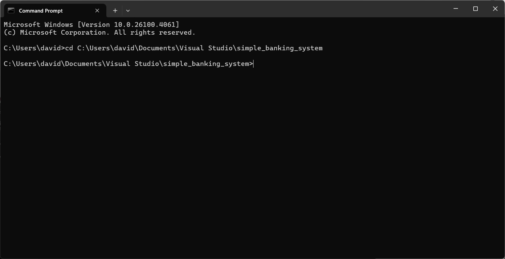
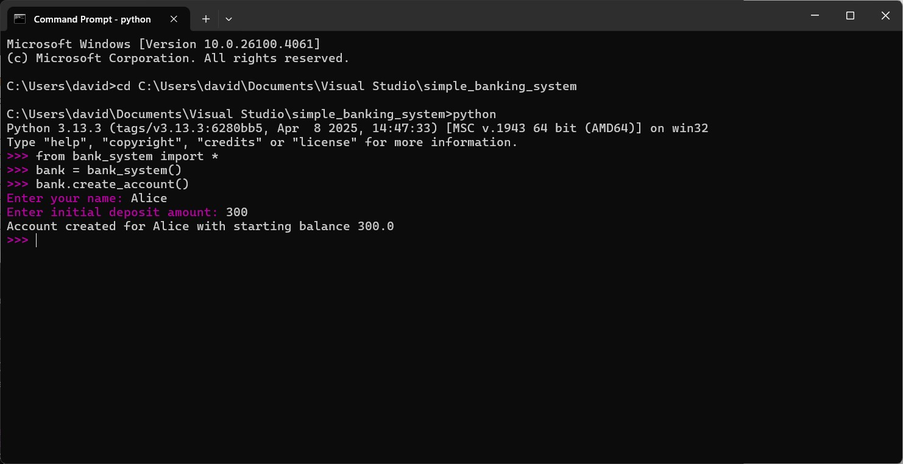

# simple_banking_system

This repository consist of two python script. One of it is the main file and the other one is the testing file.
We need to invoke the python interactive shell to execute the system and its function

## Prerequisite
You need to install python and pandas package in your window environment

## Guideline
Here is the step to run the system and call the function:

1. Open the command prompt and change the directory to the folder which contain the 2 python script


2. Enter "python" to initiate the python interactive shell 
```
python
```


3. Then enter the following code to import all the module from my bank_system and create an instance of bank_system
```python
from bank_system import *
bank = bank_system()
```


4. Then you can call the following function to perform different action in the banking system. The screenshot is one the function example for creating new customers. Here is the list of function you can do in this banking system
```python
bank.create_account()           # Will prompt for name and deposit as starting balance
bank.deposit('Alice', 100)      # Deposit to Alice's account for 100 dollars
bank.withdraw('Alice', 50)      # Withdraw from Alice's account for 50 dollars
bank.show_customers()           # Show all customers and balances
bank.transfer('Alice', 'Bob', 20)  # Transfer from Alice to Bob, with the amount of 20 dollars
bank.save_to_csv('accounts.csv')   # Save to CSV, it will save the csv file in the same directory of python script
bank.load_from_csv('accounts.csv') # Load from CSV, please place the csv file in the same directory with python script
```


## Testing file
For executing the test case in the test_bank_system.py, you can open a new command prompt and change the directory to the 2 python script file, and enter the following command. It will run the test case and showing the result of each function test case
```
python test_bank_system.py
```


